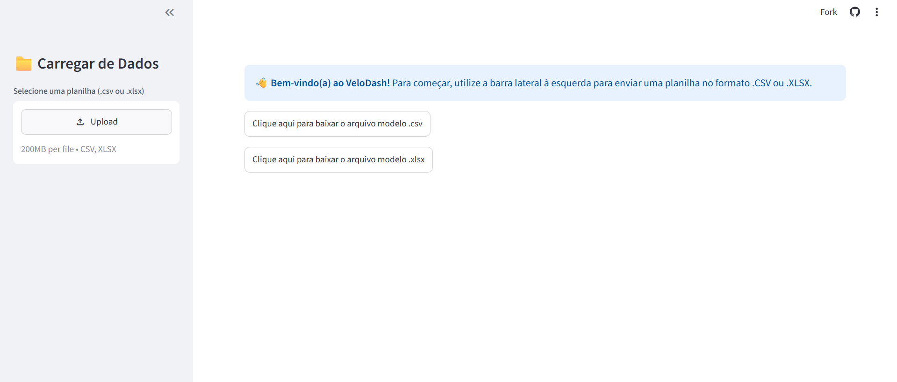

# VeloDash 🚀

<p align="center">
  
  
  
  
</p>

### Dashboard Operacional e de Performance

> Aplicação web interativa desenvolvida em Python para análise de dados operacionais, acompanhamento de indicadores e visualização de métricas financeiras.

<p align="center">
  
</p>

<p align="center">
  <a href="https://velodash-dashboard.streamlit.app/" target="_blank">
    
  </a>
</p>

---

## Sobre o projeto

O **VeloDash** é uma aplicação web interativa desenvolvida em Python com foco na análise e visualização de dados operacionais e financeiros relacionados a pedidos.

A aplicação permite importar arquivos de dados, realizar filtros personalizados, acompanhar indicadores de desempenho e visualizar informações por meio de gráficos interativos.

O projeto busca transformar dados brutos em informações mais claras e organizadas, facilitando a análise de desempenho e o acompanhamento dos principais indicadores da operação.

---

## Funcionalidades

### 📂Importação e validação de dados

- Importação de arquivos nos formatos `.csv` e `.xlsx`;
- Validação da estrutura dos arquivos importados;
- Tratamento de dados inconsistentes ou mal formatados;
- Tratamento de exceções durante o carregamento e processamento dos arquivos.

### 📊 Indicadores de desempenho

O dashboard apresenta indicadores (KPIs) calculados dinamicamente a partir dos dados carregados:

- Total de registros;
- Valor financeiro acumulado;
- Média de faturamento por pedido.

Os indicadores são atualizados conforme os filtros aplicados pelo usuário.

### 🔎Filtros interativos

A aplicação possui filtros globais que permitem analisar os dados de acordo com diferentes critérios:

- Período;
- Categoria de produto;
- Status do processo.

### 📈 Visualização de dados

O VeloDash utiliza gráficos interativos para facilitar a interpretação das informações:

- **Gráfico de linha:** apresenta a evolução temporal da soma dos valores;
- **Gráfico de rosca:** apresenta a distribuição percentual do volume financeiro por status.

### 📋 Tabela de auditoria

Os dados podem ser visualizados em uma tabela centralizada, permitindo consultar os registros utilizados na análise.

Os diferentes status dos pedidos recebem elementos visuais de destaque, facilitando sua identificação.

### 📥 Exportação de dados

Após aplicar os filtros desejados, o usuário pode exportar os dados resultantes para um arquivo `.csv`.

Dessa forma, é possível utilizar posteriormente apenas o conjunto de informações selecionado durante a análise.

---

## Tecnologias utilizadas

| Tecnologia | Aplicação no projeto |
|---|---|
| **Python 3** | Desenvolvimento da aplicação e processamento dos dados |
| **Streamlit** | Construção da interface e do dashboard interativo |
| **Pandas** | Manipulação, tratamento e análise dos dados |
| **Plotly Express** | Criação dos gráficos interativos |
| **SQLite3** | Estrutura e gerenciamento do banco de dados |

---

## Estrutura do projeto

```text
velodash/
│
├── .devcontainer/       # Configuração do ambiente de desenvolvimento
├── assets/              # Recursos visuais utilizados no projeto
├── modelo_arquivos/     # Arquivos utilizados como modelo para importação
├── src/                 # Código-fonte da aplicação
│
├── .gitignore           # Arquivos e pastas ignorados pelo Git
├── README.md            # Documentação do projeto
└── requirements.txt     # Dependências da aplicação
```

> O ambiente virtual `.venv` é utilizado localmente para gerenciamento das dependências e não faz parte dos arquivos versionados do projeto.

---

## Como executar o projeto localmente

### 1. Clone o repositório

```bash
git clone https://github.com/AnaCrisBrito/velodash.git
```

### 2. Acesse a pasta do projeto

```bash
cd velodash
```

### 3. Crie um ambiente virtual

No Windows:

```bash
python -m venv .venv
```

No Linux/macOS:

```bash
python3 -m venv .venv
```

### 4. Ative o ambiente virtual

**Windows:**

```bash
.venv\Scripts\activate
```

**Linux/macOS:**

```bash
source .venv/bin/activate
```

### 5. Instale as dependências

```bash
pip install -r requirements.txt
```

### 6. Execute a aplicação

```bash
streamlit run src/app.py
```

Após executar o comando, o Streamlit disponibilizará a aplicação localmente no navegador.

---

## Aplicação em produção

O VeloDash está disponível para acesso online através do Streamlit:

**https://velodash-dashboard.streamlit.app/**

---

## Tratamento de erros

Para aumentar a confiabilidade da aplicação, foram implementadas rotinas de tratamento de exceções utilizando `try/except`.

Essas rotinas permitem lidar com situações como:

- Arquivos corrompidos;
- Estruturas de planilhas incompatíveis;
- Dados em formatos inesperados;
- Problemas durante o processamento das informações.

O objetivo é evitar que entradas inválidas interrompam inesperadamente a execução da aplicação.

---

## Principais conceitos aplicados

Durante o desenvolvimento do VeloDash foram trabalhados conceitos relacionados a:

- Programação em Python;
- Manipulação e análise de dados;
- Tratamento e validação de arquivos;
- Criação e utilização de indicadores (KPIs);
- Visualização de dados;
- Construção de dashboards interativos;
- Filtros dinâmicos;
- Exportação de dados;
- Tratamento de exceções;
- Banco de dados;
- Desenvolvimento de aplicações web;
- Deploy de aplicações.

---

## Objetivo do projeto

O principal objetivo do VeloDash é apresentar uma solução capaz de organizar e transformar dados operacionais em informações visuais e indicadores de fácil interpretação.

Através de uma interface interativa, o usuário pode explorar os dados, identificar padrões, acompanhar métricas e gerar conjuntos de informações filtradas para análises posteriores.

---

## Próximos passos

Algumas possibilidades de evolução para o projeto incluem:

- Ampliação dos indicadores disponíveis;
- Inclusão de novos tipos de visualizações;
- Aprimoramento da validação dos arquivos importados;
- Expansão dos filtros disponíveis;
- Melhorias na organização e experiência de uso da interface;
- Implementação de novos recursos de análise de dados.

---

## Autora
<table border="0">
  <tr>
    <td align="center" width="150px">
      <br />
      <b>Ana Cristina Brito</b>
    </td>
    <td>
      Estudante de <b>Sistemas para Internet</b>, desenvolvedora com foco em aplicações web e análise de dados.<br/><br/>
      <a href="https://github.com/AnaCrisBrito">
        
      </a>
      <a href="https://velodash-dashboard.streamlit.app/">
        
      </a>
    </td>
  </tr>
</table>
